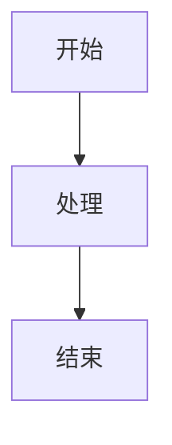

# 📁 文章系统使用指南

## 🎯 固定文章目录

您现在有一个专门的文章目录：`/articles/`

### 📂 目录结构

```
articles/
├── example/
│   └── markdown-syntax.md        # Markdown语法示例
├── 深度学习基础知识/
│   ├── 激活函数.md
│   ├── 损失函数/
│   │   ├── 损失函数总览.md
│   │   ├── MAE.md
│   │   ├── MSE.md
│   │   └── 相对熵与交叉熵.md
│   └── 模型优化/
│       ├── 梯度优化方法.md
│       ├── Adam.md
│       ├── SGD.md
│       ├── Momentum.md
│       ├── RMSprop.md
│       └── 正则化.md
├── llm/
│   ├── llama/
│   │   ├── 总览.md
│   │   └── llama-example.md
│   ├── deepseek/
│   │   └── intro.md
│   └── qwen/
│       └── 量化的核心原理.md
└── [您的新文章目录]
```

## ✨ 如何添加新文章

### 1. 创建目录结构
```bash
mkdir -p articles/新分类/子分类
```

### 2. 创建Markdown文件
```bash
touch articles/新分类/子分类/文章名.md
```

### 3. 添加Front Matter
每个文章都需要包含以下头部信息：

```yaml
---
title: "文章标题"
description: "文章描述"
date: 2024-09-06
tags: ["标签1", "标签2", "标签3"]
---

# 文章内容开始

您的Markdown内容...
```

### 4. **重要：更新articles.md文件**

⚠️ **关键步骤**：为了让新文章在网站上显示，您必须在`articles.md`文件中添加文章信息！

1. 打开`articles.md`文件
2. 在`allArticles`数组中添加新文章：

```javascript
{
  title: '您的文章标题',
  url: '{{ site.baseurl }}/articles/分类/子分类/文章名/',
  type: 'markdown',
  category: '分类名称',
  date: '2024-09-06',
  tags: ['标签1', '标签2'],
  description: '文章描述'
},
```

**注意**：系统会自动生成HTML文件，但articles页面使用JavaScript手动管理文章列表，因此必须手动添加到articles.md中！

## 🚀 支持的功能

### ✅ 数学公式
- 行内公式：`$E = mc^2$` 
- 块级公式：
```latex
$$
\frac{\partial}{\partial W} \|XW - Y\|^2_F = 2X^T(XW - Y)
$$
```

### ✅ 代码高亮
支持多种编程语言：
```python
def hello_world():
    print("Hello, World!")
```

### ✅ 图表支持
使用Mermaid语法：


### ✅ 表格
| 列1 | 列2 | 列3 |
|-----|-----|-----|
| 内容1 | 内容2 | 内容3 |

### ✅ 任务列表
- [x] 已完成任务
- [ ] 待完成任务

## 🔧 自动处理机制

1. **自动HTML生成**：放入Markdown文件后，系统会自动生成对应的HTML页面
2. **URL结构**：`/articles/分类/子分类/文章名/`
3. **分级显示**：Articles页面会按分类自动组织显示
4. **实时更新**：Jekyll会监控文件变化并自动重新生成

## 📝 推荐文章组织方式

```
articles/
├── 技术分享/
│   ├── AI与机器学习/
│   ├── 编程语言/
│   └── 系统架构/
├── 项目经验/
│   ├── 开源项目/
│   └── 商业项目/
├── 学习笔记/
│   ├── 论文阅读/
│   └── 课程笔记/
└── 思考总结/
    ├── 技术思考/
    └── 职业发展/
```

## 🎉 完成！

现在您只需要：
1. 在 `articles/` 目录下创建分类文件夹
2. 添加Markdown文件
3. 系统会自动处理并在网站上显示

所有文章都支持完整的Markdown语法，包括数学公式、代码高亮、图表等功能！