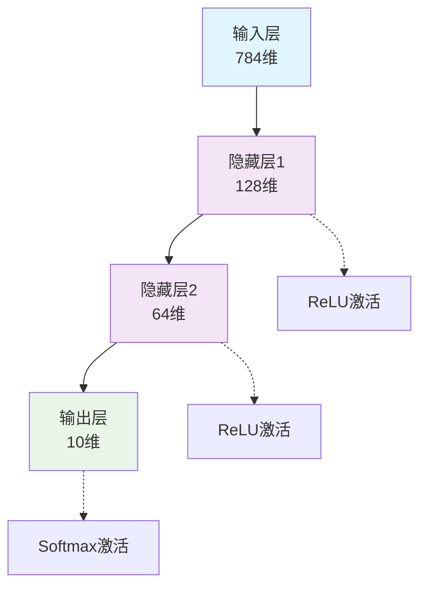
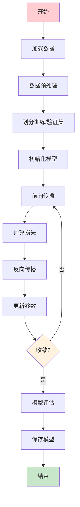

# 完整Markdown语法示例

这是一个展示所有支持的Markdown语法功能的示例文档。

## 1. 基础文本格式

这是 **粗体文本** 和 *斜体文本*，还有 ~~删除线文本~~。

你也可以使用 `行内代码` 来突出显示代码片段。

## 2. 数学公式

### 行内数学公式

这是一个行内数学公式：$E = mc^2$，爱因斯坦的质能方程。

傅里叶变换的定义：$F(\omega) = \int_{-\infty}^{\infty} f(t) e^{-i\omega t} dt$

### 块级数学公式

贝叶斯定理：

$$P(A|B) = \frac{P(B|A)P(A)}{P(B)}$$

神经网络的前向传播：

$$
\begin{align}
z^{(l)} &= W^{(l)}a^{(l-1)} + b^{(l)} \\
a^{(l)} &= \sigma(z^{(l)})
\end{align}
$$

矩阵求导：

$$
\frac{\partial}{\partial W} \|XW - Y\|^2_F = 2X^T(XW - Y)
$$

## 3. 代码块

### Python代码

```python
import numpy as np
import matplotlib.pyplot as plt
from sklearn.model_selection import train_test_split

def neural_network_forward(X, W1, b1, W2, b2):
    """
    神经网络前向传播
    """
    # 第一层
    z1 = np.dot(X, W1) + b1
    a1 = np.tanh(z1)  # 激活函数
    
    # 第二层
    z2 = np.dot(a1, W2) + b2
    a2 = 1 / (1 + np.exp(-z2))  # Sigmoid激活函数
    
    return a1, a2

# 生成示例数据
X = np.random.randn(100, 2)
y = (X[:, 0] + X[:, 1] > 0).astype(int)

print(f"数据形状: X={X.shape}, y={y.shape}")
```

### JavaScript代码

```javascript
// 深度学习框架的简单实现
class NeuralNetwork {
    constructor(layers) {
        this.layers = layers;
        this.weights = this.initializeWeights();
        this.biases = this.initializeBiases();
    }
    
    initializeWeights() {
        const weights = [];
        for (let i = 0; i < this.layers.length - 1; i++) {
            const weight = Array(this.layers[i])
                .fill()
                .map(() => Array(this.layers[i + 1])
                    .fill()
                    .map(() => Math.random() * 2 - 1)
                );
            weights.push(weight);
        }
        return weights;
    }
    
    forward(input) {
        let activation = input;
        for (let i = 0; i < this.weights.length; i++) {
            activation = this.matrixMultiply(activation, this.weights[i]);
            activation = activation.map(x => this.sigmoid(x));
        }
        return activation;
    }
    
    sigmoid(x) {
        return 1 / (1 + Math.exp(-x));
    }
}

// 使用示例
const nn = new NeuralNetwork([2, 4, 1]);
const result = nn.forward([0.5, 0.3]);
console.log('预测结果:', result);
```

### Shell脚本

```bash
#!/bin/bash

# 深度学习环境设置脚本
setup_dl_environment() {
    echo "正在设置深度学习环境..."
    
    # 创建虚拟环境
    python -m venv venv
    source venv/bin/activate
    
    # 安装依赖
    pip install --upgrade pip
    pip install torch torchvision torchaudio
    pip install tensorflow
    pip install numpy pandas matplotlib seaborn
    pip install jupyter notebook
    
    echo "环境设置完成！"
}

# GPU检查
check_gpu() {
    if command -v nvidia-smi &> /dev/null; then
        echo "GPU信息:"
        nvidia-smi --query-gpu=name,memory.total --format=csv
    else
        echo "未检测到NVIDIA GPU"
    fi
}

setup_dl_environment
check_gpu
```

## 4. 表格

| 模型 | 参数量 | 训练数据 | 性能评分 | 发布时间 |
|------|--------|----------|----------|----------|
| GPT-3 | 175B | 45TB | 95.2 | 2020-06 |
| GPT-4 | ~1.7T | 未公开 | 98.1 | 2023-03 |
| Llama 2 | 70B | 2T tokens | 94.7 | 2023-07 |
| Claude 3 | 未公开 | 未公开 | 97.3 | 2024-03 |

## 5. 引用

> "人工智能是新的电力。" 
> 
> — 吴恩达

> **重要提示：**
> 
> 在实际应用中，确保你的模型具有良好的泛化能力是至关重要的。过拟合是机器学习中的常见问题。

## 6. 列表

### 无序列表

- **深度学习框架**
  - PyTorch
    - 动态计算图
    - 强大的GPU支持
    - 活跃的社区
  - TensorFlow
    - 静态计算图（TF 1.x）
    - TensorBoard可视化
    - 生产环境部署

### 有序列表

1. **数据预处理**
   1. 数据清洗
   2. 特征工程
   3. 数据标准化
2. **模型训练**
   1. 模型选择
   2. 超参数调优
   3. 交叉验证
3. **模型评估**
   1. 性能指标计算
   2. 模型解释性分析
   3. 错误分析

## 7. 链接和图片

[GitHub](https://github.com) | [TensorFlow官网](https://tensorflow.org) | [PyTorch官网](https://pytorch.org)

## 8. 图表（Mermaid）

### 神经网络架构图



### 训练流程图



## 9. 任务列表

- [x] 实现基础神经网络
- [x] 添加激活函数支持
- [x] 实现反向传播算法
- [ ] 添加正则化技术
- [ ] 实现不同优化器
- [ ] 添加模型可视化功能

## 10. 脚注

这是一个包含脚注的句子[^1]。还有另一个脚注[^2]。

[^1]: 这是第一个脚注的内容，解释了相关概念。
[^2]: 这是第二个脚注，提供了额外的信息和参考资料。

## 11. 高亮文本

==这是高亮文本==，用于强调重要内容。

## 12. 总结

这个示例展示了我们的Markdown支持的所有功能：

1. ✅ **基础格式** - 粗体、斜体、删除线
2. ✅ **数学公式** - 行内和块级LaTeX数学公式
3. ✅ **代码高亮** - 多种编程语言的语法高亮
4. ✅ **表格** - 支持复杂表格格式
5. ✅ **引用块** - 多级引用支持
6. ✅ **列表** - 有序和无序列表
7. ✅ **图表** - Mermaid图表支持
8. ✅ **任务列表** - 交互式复选框
9. ✅ **脚注** - 文档内脚注引用

所有这些功能都已经在我们的技术博客中得到了完整支持！